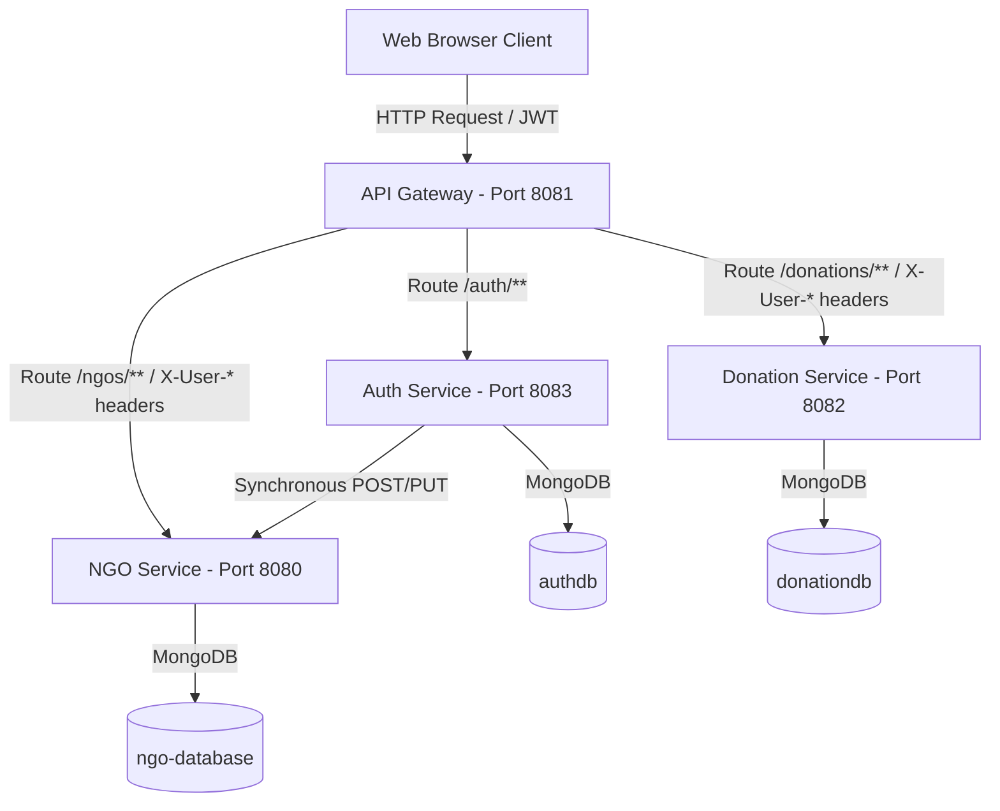

# NGO & Donation Management System (Microservices)

A full-stack, secure, and responsive microservices application built with Spring Boot, Spring Cloud Gateway, and MongoDB. The system facilitates registration and profile validation for NGOs, enables donor contribution management, and offers an administrative control panel for audit monitoring and verification workflows.

---

## System Architecture

---

## Technology Stack

*   **Backend Core**: Java 21, Spring Boot
*   **Security & Gateways**: Spring Cloud Gateway, JWT (JSON Web Tokens), BCrypt Password Encryption
*   **Databases**: MongoDB (NoSQL)
*   **Frontend**: HTML5, Vanilla CSS3 (Custom properties, CSS Grid, Glassmorphism), JavaScript (ES6+ Async/Await)
*   **Build Tool**: Maven

---

## Core Features

### 1. Centralized Security Edge
*   **API Gateway Interceptor**: A custom reactive gateway filter intercepts client requests to secure routes (`/ngos/**` and `/donations/**`), parses/validates incoming JWTs, and injects authenticated user headers (`X-User-Id`, `X-User-Role`, `X-User-Name`, `X-User-NgoRegNo`) for internal downstream validation.

### 2. Authentication & Verification Workflows
*   **Sign Up**: Users register as either a `DONOR` or `NGO` (requiring an official Registration Number). 
*   **Double-Bound Verification**: NGO sign-ups automatically spawn a pending profile in the `ngo-service`. The account remains locked until an Admin approves it.
*   **Verification Propagation**: Admin approval verified user login flags in `auth-service` and fires synchronous REST callbacks to activate the public profile in `ngo-service`.

### 3. Role-Based Access Control (RBAC)
*   **Admins**: Can see all transaction records, delete/edit NGO profiles, and verify pending registrations.
*   **NGOs**: Can log in to manage their profiles, customize their target cause, and view donations made strictly to their registration number.
*   **Donors**: Can register, browse verified NGOs, execute contributions (which automatically bind their identities from gateway headers), and edit/delete their own transaction logs.

### 4. Custom Responsive Frontend Dashboard
*   A premium, glassmorphic dark-theme UI with responsive grid cards, dynamic real-time KPI metrics calculations, platform activity feeds, and custom animated toast notifications.

---

## Setup & Running Instructions

### Prerequisites
*   **Java JDK 21** or higher.
*   **MongoDB** running locally on default port `27017`.

### Easy Startup (One-Click)
Double-click the **`start-all.bat`** script in the project root directory. This script automatically compiles and launches all four services in separate command prompt windows:
1.  **Auth Service** (Port 8083)
2.  **NGO Service** (Port 8080)
3.  **Donation Service** (Port 8082)
4.  **API Gateway** (Port 8081)

Once they are up, navigate your browser to `http://localhost:8081`!

### Default Admin Credentials
*   **Username**: `admin`
*   **Password**: `admin123`
